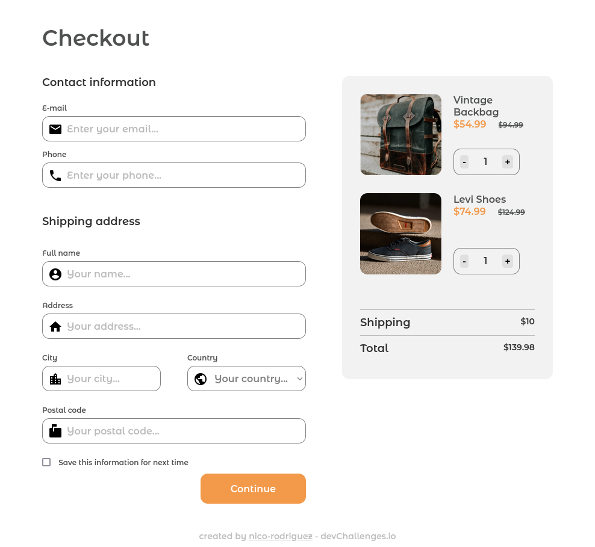
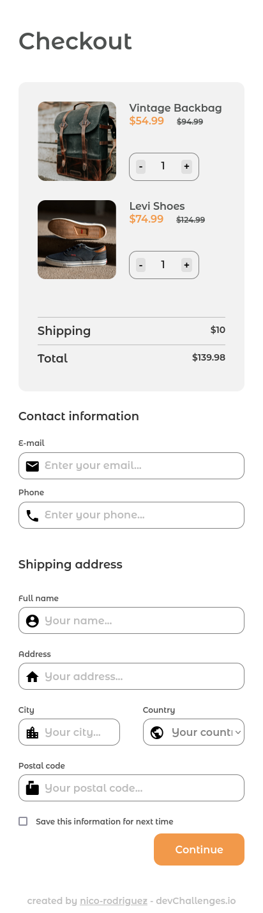

<h1 align="center">Checkout Page</h1>

   Solution for a challenge from  <a href="http://devchallenges.io" target="_blank">Devchallenges.io</a>.

  <h3>
    <a href="https://checkout-page-864c4b.netlify.app/">
      Solution
    </a>
     | 
    <a href="https://devchallenges.io/challenges/0J1NxxGhOUYVqihwegfO">
      Challenge
    </a>
  </h3>

## Overview

Visit [https://checkout-page-864c4b.netlify.app/](https://checkout-page-864c4b.netlify.app/)

Desktop

Mobile

## Features

This application/site was created as a submission to a [DevChallenges](https://devchallenges.io/challenges) challenge. The [challenge](https://devchallenges.io/challenges/0J1NxxGhOUYVqihwegfO) was to build an application to complete the given user stories.

It uses `rem` units for fonts and padding, in order to adjust for different users preferences. Some JavaScript is used for coloring the first `select` `option` differently, for computing the prices and for displaying a notification of a successful form submission. It also features some basic form validation.
